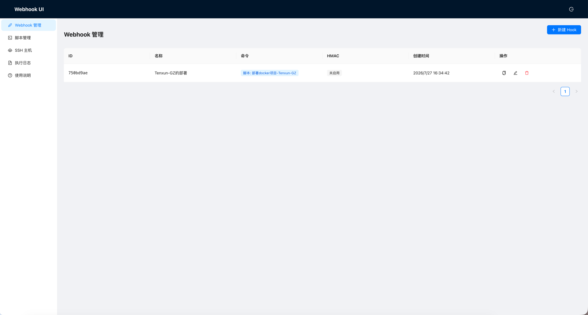

<div align="center">

# 🪝 Webhook UI

> Go + React 的自托管 Webhook 管理工具：接收 Webhook → 执行脚本/命令，带 Web 控制台、SSH 远程执行与执行日志。

单二进制部署 · SQLite 存储 · HMAC 签名校验 · Docker 镜像开箱即用

[](#)
[](#)
[](#)
[](#)

</div>

---

## ✨ 项目亮点

- **一键自托管**：单二进制 + 前端 `go:embed` 打包，零外部依赖（SQLite 内建），克隆即用。
- **Web 控制台**：可视化维护 Hook、脚本、SSH 主机，看执行日志，不用碰服务器文件。
- **异步执行**：长任务立即返回 202 + execution_id，不再被固定超时砍断；日志实时滚动、可中断。
- **脚本管理**：脚本存数据库，只管内容，支持 `bash`/`sh`/`python3`/`powershell`，页内试运行当前内容（无需保存）。
- **执行位置在 Hook 上**：同一个脚本可被不同 Hook 派到本地或不同 SSH 主机执行。
- **SSH 远程执行**：脚本通过 stdin 在远端跑，不落盘；Host Key 采用 TOFU 校验防劫持。
- **多种触发校验**：固定 Token 或 HMAC 签名（SHA1/SHA256/SHA512），原生兼容 GitHub / GitLab。
- **命令白名单**：`ALLOWED_COMMANDS` 限定可执行解释器，收口攻击面。
- **登录防爆破**：用户名+IP 失败锁定 + 每 IP 限速，暴力破解难以为继。

**适合谁用**：自建 CI/CD 触发、运维自动化、Git 仓库事件驱动机器执行、需要在隔离主机上跑脚本的小团队与个人。

## 🖼️ 界面预览



## 📦 安装

### Docker（最快）

```bash
docker run -d \
  --name webhook-ui \
  -p 9000:9000 \
  -e ADMIN_PASSWORD=your-password \
  -v webhook-data:/app/data \
  registry.cn-hangzhou.aliyuncs.com/dato/webhook-ui:latest
```

### 二进制

到 [Releases](../../releases) 下载对应平台产物（linux/darwin/windows · amd64/arm64），直接运行：

```bash
export ADMIN_PASSWORD=your-password
./webhook-ui
```

### 源码构建

```bash
git clone https://github.com/songguangzhi/webhook-ui.git
cd webhook-ui
cd web && npm ci && npm run build && cd ..
go build -ldflags "-X main.version=$(cat VERSION)" -o webhook-ui .
```

## 🚀 快速开始

启动后访问 `http://localhost:9000`，用 `ADMIN_USERNAME`（默认 `admin`）+ `ADMIN_PASSWORD` 登录。

1. **建脚本**（可选）：脚本管理页 → 新建，写内容，点「试运行」验证。
2. **建 Hook**：Hook 管理页 → 新建，二选一填「自由命令」或「绑定脚本」，选执行位置（本地 / SSH 主机），配置 Token / HMAC。
3. **触发**：

```bash
# 固定 Token
curl -X POST http://localhost:9000/hooks/<hook-id> \
  -H "X-Token: your-token"

# HMAC 签名（通用）
curl -X POST http://localhost:9000/hooks/<hook-id> \
  -H "X-Signature: $(printf 'payload' | openssl dgst -sha256 -hmac 'your-secret' -binary | xxd -p -c 256)"
```

4. **看结果**：执行日志页查看输出与状态。

## ⚙️ 环境变量

| 变量 | 说明 | 默认值 |
|------|------|--------|
| `PORT` | 服务端口 | `9000` |
| `DATA_DIR` | 数据目录（SQLite + 临时脚本） | `./data` |
| `ADMIN_USERNAME` | 管理员用户名 | `admin` |
| `ADMIN_PASSWORD` | 管理员密码 | **（必填）** |
| `SESSION_SECRET` | Session 密钥 | 自动生成 |
| `TRUSTED_PROXIES` | 可信代理 IP，逗号分隔（反代部署时配置） | `127.0.0.1` |
| `LOGIN_MAX_FAILURES` | 同一用户名+IP 连续失败多少次后锁定 | `5` |
| `LOGIN_LOCKOUT_MINUTES` | 登录锁定时长（分钟） | `15` |
| `LOGIN_RATE_LIMIT_PER_MIN` | 每 IP 每分钟登录尝试上限 | `10` |
| `ALLOWED_COMMANDS` | 允许的命令前缀，逗号分隔 | `/usr/bin/git,/usr/bin/curl,/bin/bash,/bin/sh,/usr/bin/python3` |
| `LOG_TAIL_BYTES` | 单次执行日志按尾部保留的上限（字节），超出滚删旧块 | `5242880`（5MB） |
| `MAX_CONCURRENT_EXECUTIONS` | 异步 Hook 同时运行上限 | `10` |
| `MAX_QUEUED_EXECUTIONS` | 超出并发后允许排队的数量，再满返回 429 | `100` |
| `RETENTION_DAYS` | 执行记录与日志保留天数，0 表示不清理 | `30` |

> **登录防爆破**：同一用户名+IP 连续失败锁定（默认 5 次锁 15 分钟，返回 429）；`/api/login` 每 IP 每分钟最多 10 次。锁定状态存内存，重启清零。
>
> ⚠️ **安全提示**：默认白名单包含 bash/sh/python3 解释器（脚本功能所需）。能登录控制台的管理员本质可执行任意命令——**请勿将控制台暴露给不可信网络**。无需脚本功能时用 `ALLOWED_COMMANDS` 收紧。

## 🧭 使用示例

### 传参给脚本/命令

Hook 触发时，Webhook 数据按配置注入：

| 来源 | 注入方式 |
|------|----------|
| Payload 字段 | `$1` `$2` ...（位置参数） |
| Query 参数 | `QUERY_<NAME>` 环境变量 |
| 请求头 | `HEADER_<NAME>` 环境变量 |
| 原始 Payload | `PAYLOAD` 环境变量（或按 `pass_payload_to` 注入 stdin/参数） |

示例脚本（拉取代码并部署）：

```bash
#!/bin/bash
set -e
cd "$1"            # $1 = Payload 字段，例如仓库路径
git pull origin main
./deploy.sh
```

### GitHub Webhook 对接

GitHub Push 事件 → Hook 自动校验 `X-Hub-Signature-256`（HMAC SHA256）。在 Hook 配置填入与 GitHub 仓库 Webhook secret 相同的 `HMACSecret`，算法选 `sha256` 即可。

### SSH 远程执行

Hook 的「执行位置」选 SSH 主机即可远端执行：绑定脚本时内容通过 stdin 远端执行（Linux 走 `bash -s` / `sh -s` / `python3 -`，Windows 走 `powershell -Command -`），不写远端磁盘；自由命令则直接在远端跑。填了「工作目录」会先 `cd` 进去（Windows 为 `Set-Location`），目录不存在则执行失败。SSH 主机页可「测试连接」验证凭据。

执行位置属于 Hook 而不是脚本，所以同一个部署脚本可以由 staging Hook 打到测试机、production Hook 打到生产机。执行日志会记录当次实际执行位置的快照。

> ⚠️ **SSH 执行不受 `ALLOWED_COMMANDS` 白名单限制**——白名单描述的是本机可执行文件路径，对远端主机无意义。能编辑 Hook 的管理员即可在远端主机上执行任意命令。

> **公网环境建议**：先用 `ssh-keyscan <host>` 取公钥并手动预填，避免首次连接被中间人截获。

### Windows / PowerShell 脚本

解释器选 `powershell` 的脚本，内容通过 stdin 交给远端的 `powershell -Command -` 执行。

> ⚠️ **调用外部程序（npm / git / python 等）必须走管道**，否则既看不到输出，脚本也会从调用那行起悄悄断掉。

```powershell
& <命令> <参数> 2>&1 | Out-Host
$code = $LASTEXITCODE
if ($code -ne 0) { exit $code }
```

三件套各自的作用：

| 写法 | 作用 |
| --- | --- |
| `2>&1` | 把外部程序的 stderr 并进 stdout，报错不丢 |
| `\| Out-Host` | 关键的一步：PowerShell 只有在外部程序处于管道中时才会接管它的三个流 |
| `exit $code` | 把外部程序的退出码交回 Hook，决定本次执行成功还是失败 |

**为什么不管道化就断？** `-Command -` 模式下 PowerShell 是一行一行从 stdin 读脚本的。裸调 `& npm run start` 时，子进程继承了同一个 stdin 管道，会把后面还没读到的脚本文本一起吃掉——于是 `$LASTEXITCODE` 那几行根本没机会执行，`$code` 自然是空的；同时它的 stdout 是直接继承的句柄，PowerShell 不经手，输出也就无从转发。放进管道后，PowerShell 给子进程换上自己控制的空 stdin（偷不走了）并读回 stdout（看得见了），一次解决两个症状。

其余注意事项：

- **工作目录填在 Hook 上**，不要在脚本里写 `Set-Location`——Hook 的「工作目录」字段会自动生成一条 `Set-Location`，目录不存在直接判失败。
- **别在这类脚本里设 `$ErrorActionPreference = 'Stop'`**。`2>&1` 会把外部程序的 stderr 包装成 ErrorRecord，程序往 stderr 写一行普通日志就会把整个执行炸掉。
- **`param()` 块无效**，webhook 传入的参数用 `$args[0]`、`$args[1]`，环境变量用 `$env:PAYLOAD` 等。

**长跑进程**（`npm run start`、`docker compose up` 这类不会自己退出的命令）：Hook 必须勾选「异步执行」并把超时设成足够大的值（不限则填 `0`）。同步 Hook 默认 5 分钟就会被砍断，且不允许把超时设为 `0`。

## 📁 项目结构

```
webhook-ui/
├── main.go                  # 入口、路由、版本注入
├── embed.go                 # go:embed 前端产物
├── internal/
│   ├── config/              # 环境变量加载
│   ├── database/            # SQLite 初始化与迁移
│   ├── models/              # Hook / Script / SSHHost / Execution
│   ├── handlers/            # HTTP 处理器（auth/hook/script/ssh/execution）
│   ├── middleware/          # auth / login_guard / rate_limiter
│   └── services/            # executor / ssh / hmac
├── web/                     # React 19 + Antd 6 + Vite 前端
│   └── src/
│       ├── pages/           # HookList / ScriptEdit / SSHHostList / ExecutionLogs / Login
│       └── api/             # axios client
├── .github/workflows/       # docker-build-push.yml / release.yml
├── Dockerfile
└── VERSION                  # 语义化版本
```

## 🐳 Docker 中控制宿主机

脚本默认跑在容器内，碰不到宿主机。常见方案：

1. **挂载目录**（推荐）：`-v /宿主机/目录:/workspace`，脚本操作 `/workspace` 即操作宿主文件。
2. **挂 docker.sock**：`-v /var/run/docker.sock:/var/run/docker.sock`，脚本内可跑 `docker`（等价宿主 root，风险自负）。
3. **SSH 回连**：用「SSH 远程执行」把宿主机配成 SSH 主机，脚本在宿主上跑——隔离不破、权限可控。
4. **不用 Docker**：单二进制直接跑宿主机，脚本天然就是宿主命令。

## 📡 API

### Webhook 触发

```
POST /hooks/:id          # 也支持 GET（见 0.2.0+）
```

**响应契约**：同步 Hook 返回 `200`，body 带完整 `output`；异步 Hook（Hook 上勾选「异步执行」）返回 `202`，body 带 `execution_id` 与 `status: queued`，随后凭 id 轮询日志。同一异步 Hook 上次未结束时再次触发返回 `409`（body 带 `running_execution_id`）；并发与队列均满返回 `429`。

访问校验二选一或同用：

- **固定 Token**：配置 Token 后，请求带 `X-Token` header 或 `?token=`，值相等才执行。适合不能算 HMAC 的调用方。
- **HMAC 签名**：
  - GitHub：`X-Hub-Signature-256`
  - GitLab：`X-Gitlab-Token`
  - 通用：`X-Signature`

### 管理 API（需登录）

| 方法 | 路径 | 说明 |
|------|------|------|
| `POST` | `/api/auth/login` · `/api/auth/logout` | 登录 / 登出 |
| `GET/POST` | `/api/hooks` | Hook 列表 / 创建 |
| `GET/PUT/DELETE` | `/api/hooks/:id` | 详情 / 更新 / 删除 |
| `GET` | `/api/executions` · `/api/executions/:id` · `/api/executions/:id/logs` | 执行记录 / 详情 / 增量日志 |
| `POST` | `/api/executions/:id/cancel` | 中断正在运行的异步执行 |
| `GET/POST` | `/api/settings/api-token` · `/api/settings/api-token/regenerate` | 查看 / 重新生成 API token |
| `GET/POST/PUT/DELETE` | `/api/scripts` | 脚本管理 |
| `POST` | `/api/scripts/test` | 试运行脚本 |
| `GET/POST/PUT/DELETE` | `/api/ssh-hosts` | SSH 主机管理 |
| `POST` | `/api/ssh-hosts/test` | 测试连接 |

### 外部只读 API（凭 API token）

在「设置」页生成 token 后，外部系统（CI、监控等）凭 `X-API-Token` 请求头访问，**无需登录**，作用域仅限只读执行记录与日志：

| 方法 | 路径 | 说明 |
|------|------|------|
| `GET` | `/api/external/executions` | 执行记录列表（支持 `limit`/`offset`/`hook_id`） |
| `GET` | `/api/external/executions/:id` | 单条详情 |
| `GET` | `/api/external/executions/:id/logs` | 增量日志，`?after_seq=N` 游标轮询 |

响应带 `next_seq`（下次起点）、`oldest_seq`（仍在的最老序号——你的游标比它小说明中间丢过一段）、`has_more`（还有积压）、`status`/`finished`。token 打不开 `/api/...` 的会话端点，也碰不到 hooks/scripts/ssh-hosts 及任何写操作与中断。

## 🛠️ 开发

后端：

```bash
go run main.go          # :9000
go test ./...           # 单测
```

前端（开发模式，自动代理 `/api` 和 `/hooks` 到 `localhost:9000`）：

```bash
cd web
npm run dev             # Vite dev server
npm run lint            # oxlint
```

## 📦 打包发版

> 见 `CLAUDE.md` 完整约定。简要：

1. 升 `VERSION`（语义化，默认升 minor）→ commit → push main。
2. `git tag vx.y.z && git push origin vx.y.z`（tag 必须带 `v` 前缀）。
3. GitHub Actions 自动：构建推送 Docker 镜像到阿里云 ACR + 前端构建交叉编译发 GitHub Release。

## 🤝 贡献

欢迎 Issue / PR。提交前请跑 `go test ./...` 与 `cd web && npm run lint`。

## 📝 License

MIT
